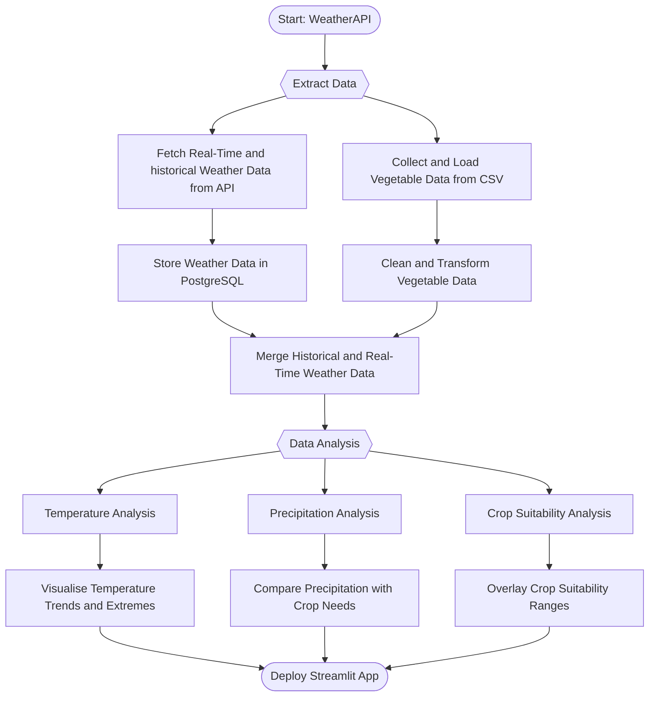

### High-Level Flowchart: Weather and Vegetable Data Analysis Application

```mermaid
flowchart TD
    A([Start: WeatherAPI]) --> B{{Extract Data}}
    B --> C1[Fetch Real-Time and historical Weather Data from API]
    B --> C2[Collect and Load Vegetable Data from CSV]
    C1 --> D1[Store Weather Data in PostgreSQL]
    C2 --> D2[Clean and Transform Vegetable Data]
    D1 --> E[Merge Historical and Real-Time Weather Data]
    D2 --> E
    E --> F{{Data Analysis}}
    F --> G1[Temperature Analysis]
    F --> G2[Precipitation Analysis]
    F --> G3[Crop Suitability Analysis]
    G1 --> H[Visualise Temperature Trends and Extremes]
    G2 --> I[Compare Precipitation with Crop Needs]
    G3 --> J[Overlay Crop Suitability Ranges]
    H --> K([Deploy Streamlit App])
    I --> K
    J --> K
```