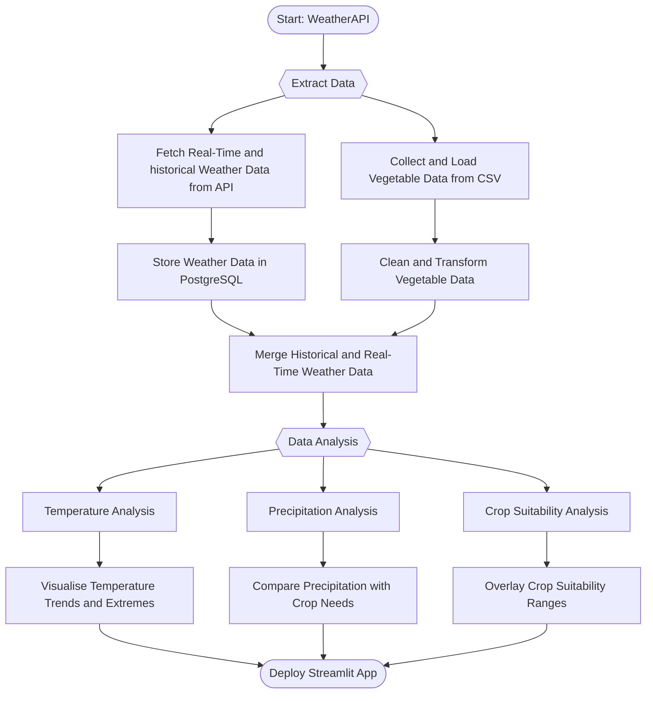

## Project Overview

### **Objective**
To develop an interactive weather data application that analyses historical and real-time weather data from WeatherAPI to assess the suitability of Bristol and London for growing tomatoes, blackberries, and lettuce. The application leverages data visualisation, vegetable-specific comparisons, and real-time insights to empower gardening decisions and optimise crop growth.

### **Goals**
1. **Data Acquisition**:
   - Automatically fetch historical and real-time weather data for Bristol and London.
   - Store the data in a PostgreSQL database for structured access and incremental updates.

2. **Data Transformation**:
   - Process weather data to fill missing dates, calculate monthly averages, and identify extreme conditions.
   - Integrate vegetable-specific data on optimal temperature and precipitation ranges.

3. **Data Visualisation**:
   - Create engaging visualisations, including temperature trends, precipitation patterns, and crop comparisons.
   - Provide insights into extreme weather events and crop suitability.

4. **User Interaction**:
   - Build an intuitive Streamlit dashboard to allow users to:
     - Select cities dynamically.
     - Compare weather conditions with vegetable requirements.
     - Explore interactive features like fun facts and progress bars.

---


## Identify the User Stories


| Epic                                     | User Requirements                                                                                             |
|------------------------------------------|---------------------------------------------------------------------------------------------------------------|
| Epic 1: Data Availability and Integration | - Data engineers need access to historical and current weather data for Bristol and London.                    |
|                                          | - Data engineers require the data to be stored in a PostgreSQL database to ensure it is structured and accessible for analysis. |
| Epic 2: Crop Suitability Analysis        | - Data analysts want to compare Bristol and London weather data (temperature and precipitation) against optimal conditions for tomatoes, lettuce, and blackberries. |
|                                          | - Data scientists want insights into whether the crops can thrive based on historical and current weather trends. |
| Epic 3: Visualisation and Insights       | - Data analysts want clear visualisations of weather trends, including temperature overviews, precipitation patterns, and monthly trends. |
|                                          | - Data analysts want specific insights into extreme weather events and how they affect crops.                  |
| Epic 4: Data Interactivity               | - Data engineers and analysts need the ability to input different cities to retrieve dynamic weather insights. |
|                                          | - Data engineers want interactive elements, such as vegetable-specific data visualisation and the ability to compare with optimal conditions. |             |


### User Stories

#### Epic 1: Data Availability and Integration

```txt
USER STORY 1

As a Data Engineer,  
I want access to both historical and real-time weather data for specific cities like Bristol and London,  
So that I can store and process this data in a PostgreSQL database for analysis.

USER STORY 2

As a Data Engineer,  
I want to ensure that the weather data is structured and stored efficiently in the database,  
So that it can be easily accessed and queried for various analyses.
```

#### Epic 2: Crop Suitability Analysis

```txt
USER STORY 3

As a Data Analyst,  
I want to compare weather data with the optimal temperature and precipitation ranges for tomatoes, blackberries, and lettuce,  
So that I can determine whether these crops can thrive in Bristol and London.

USER STORY 4

As a Data Scientist,  
I want to identify gaps where weather conditions deviate from the ideal growing conditions of crops,  
So that I can provide actionable insights on when to use tools like greenhouses or drainage systems.
```

#### Epic 3: Visualisation and Insights
```txt
USER STORY 5

As a Data Analyst,  
I want to visualise weather patterns, including temperature overviews and precipitation trends,  
So that I can easily identify key insights and anomalies.

USER STORY 6

As a Data Analyst,  
I want to see a comparison of recorded weather data against crop requirements in clear visualisations,  
So that I can present findings to stakeholders in a meaningful way.
```

#### Epic 4: Data Interactivity

```txt
USER STORY 7

As a Data Engineer,  
I want the application to allow users to input cities dynamically,  
So that I can retrieve weather insights for a wide range of locations.

USER STORY 8

As a Data Analyst,  
I want interactive features like vegetable-specific visualisations and fun facts,  
So that the application engages users and provides a seamless experience.
```

### High-Level Flowchart: Weather and Vegetable Data Analysis Application

